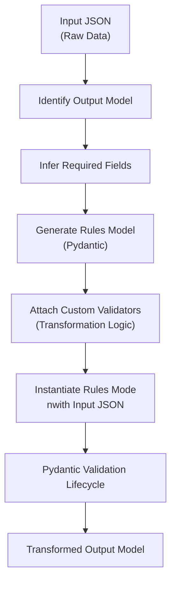

# 🧩 Pydantic‑Driven Transformation Blackbox

## Overview

This project implements a **Pydantic‑centric data transformation blackbox**.

Instead of using a traditional rule engine or DSL executor, the entire transformation process is driven by **Pydantic models and custom validators**.  
The output requirements (receiver models) determine *what transformations are required*, and Pydantic validators perform those transformations automatically during model instantiation.

> **Model creation = Transformation execution**

---

## 🎯 Problem Statement

- A raw **input JSON** is received from a producer system.
- Multiple downstream systems expect **different output formats**.
- Each output format may require:
  - Field selection
  - Normalization
  - Derivation
  - Enrichment
- The system must:
  - Avoid imperative rule execution
  - Avoid a standalone transformation engine
  - Guarantee correctness using schemas

---

## 💡 Core Idea

> **The output model drives the transformation.**

Instead of writing and executing rules manually:
1. Inspect the required **output Pydantic model**
2. Generate a **Rules Model** (also a Pydantic model)
3. Embed transformation logic inside **custom validators**
4. Instantiating the model automatically produces the output

---

## 🏗️ Key Components

### 1. Input JSON
- Raw, untransformed source data
- Treated as the source of truth

### 2. Output Models (Receiver Contracts)
- Pydantic models defining:
  - Required fields
  - Types
  - Nested structure
- Each receiver has its own output model

### 3. Rules Model (Generated)
- A dynamically derived Pydantic model
- Contains:
  - Output fields
  - Custom validators for transformation
- Acts as the **transformation pipeline**

### 4. Pydantic Validation Lifecycle
- Executes validators automatically
- Becomes the execution engine

---

## 🔄 High‑Level Flow

## 🪜 Step‑by‑Step Execution Flow

### Step 1: Input JSON is received
- The blackbox receives a raw input JSON file from a producer system.
- No transformation is applied at this stage.
- The data is treated as the **source of truth**.

**Intent:**  
This data represents raw input, not the final output.

---

### Step 2: Output model is selected
- A receiver‑specific Pydantic output model is identified.
- This model defines:
  - Required fields
  - Field types
  - Nested structure

**Intent:**  
Determine the exact shape and constraints of the required output.

---

### Step 3: Required fields are inferred
- The blackbox inspects the output model to understand:
  - Which fields map directly from input
  - Which fields must be derived or transformed
- This step defines the transformation intent.

**Intent:**  
Identify what data must be computed to satisfy the output schema.

---

### Step 4: Rules Model is generated
- A new **Pydantic Rules Model** is dynamically generated.
- This model:
  - Accepts the input JSON
  - Declares all required output fields
  - Acts as the transformation container

**Important:**  
There is no imperative transformation engine at this stage.

---

### Step 5: Custom validators are attached
- Transformation logic is embedded using Pydantic validators:
  - **Field validators**
    - Normalize values
    - Split text
    - Extract nested fields
  - **Model validators**
    - Combine multiple fields
    - Enforce cross‑field consistency
    - Derive dependent values

**Intent:**  
Validators are intentionally used as transformation steps.

---

### Step 6: Rules Model is instantiated
- The blackbox instantiates the Rules Model using the input JSON.
- This single action triggers the transformation process.

**Key Insight:**  
Transformation occurs as a side‑effect of model validation.

---

### Step 7: Pydantic validation lifecycle runs
Pydantic automatically executes the validation phases:
1. `before` field validators
2. Type parsing and validation
3. `after` field validators
4. Model‑level validators

Each validator:
- Reads from the input data
- Computes derived values
- Populates output fields

---

### Step 8: Transformed data is materialized
- After validation completes:
  - The Rules Model instance contains fully transformed data
  - All required output fields are populated
- No intermediate execution state is exposed.

---

### Step 9: Output is emitted
- The Rules Model instance is:
  - Serialized
  - Returned
  - Or mapped to a receiver‑specific output format
- For multiple receivers:
  - The same input JSON is reused
  - Separate Rules Models are generated per output model

---

## 🧠 Mental Model

Input JSON
   +
Output Model
   ↓
Generated Rules Model
   ↓
Pydantic Validators Execute
   ↓
Output

## 📌 Summary

This project implements a **Pydantic‑driven transformation blackbox** where the entire data transformation process is executed through **custom validators**, rather than an imperative rule engine.

The system receives a raw input JSON and determines the required output format based on **receiver‑specific Pydantic output models**. From these output models, a **Rules Model** is dynamically generated. This Rules Model embeds all transformation logic inside **field‑level and model‑level validators**.

Instantiating the Rules Model with the input JSON automatically triggers the Pydantic validation lifecycle. During this lifecycle, validators read from the input data, compute derived values, normalize fields, and populate the required output structure. As a result, **model creation itself becomes the execution mechanism** for transformation.

This design provides:
- A fully declarative, schema‑driven transformation pipeline
- Strong validation guarantees at every stage
- No explicit transformation engine or rule execution loop
- Clear alignment between input data, transformation logic, and output contracts

In this architecture, **validation is execution**, and the final model instance represents a fully transformed, output‑ready result.
