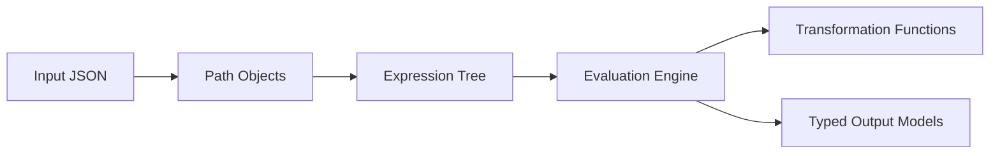
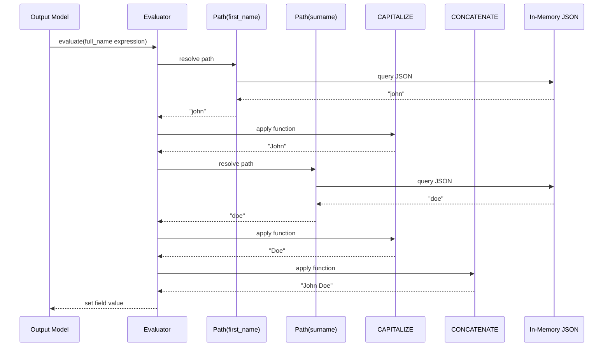

JSON Transformation Framework
=============================

### Declarative, Path‑Driven Data Mapping Engine

Overview
--------

This framework provides a **declarative way to transform structured JSON data into strongly‑typed output models**.

Instead of writing imperative transformation code, users define:

*   **where data comes from** (using paths)
    
*   **how data is transformed** (using composable functions)
    
*   **what the final output looks like** (via typed models)
    

Transformation logic is represented as **expression trees** that are evaluated at runtime against in‑memory JSON data.

Core Idea
---------

> **Transformation logic is described, not executed directly.**

The system separates:

*   **Data access** (paths)
    
*   **Transformation intent** (function composition)
    
*   **Execution** (evaluation engine)
    

This allows complex mappings to remain readable, testable, and extensible.

Key Capabilities
----------------

*   Declarative transformation definitions
    
*   JSONPath‑based data access
    
*   Composable transformation expressions
    
*   Typed output models
    
*   Single JSON load per execution
    
*   Deterministic evaluation order
    
*   Editor‑friendly authoring (autocomplete, linting, refactoring)
    

High‑Level Architecture
-----------------------



```mermaid
flowchart LR
    A[Input JSON] --> B[Path Objects]
    B --> C[Expression Tree]
    C --> D[Evaluation Engine]
    D --> E[Transformation Functions]
    D --> F[Typed Output Models]

```


Core Concepts
-------------

### 1\. Path

A **Path** represents _where_ data should be retrieved from the input JSON.

*   Encapsulates a JSONPath expression
    
*   Does not execute logic
    
*   Does not perform I/O
    
*   Can be reused across transformations
    

Conceptually:

> “This value comes from here in the JSON.”

### 2\. Transformation Expressions

Transformations are built by **composing functions and paths** into an expression tree.

Each node in the tree represents either:

*   a path lookup
    
*   a function application
    
*   a literal value
    

This tree fully describes _what_ computation should occur.

### 3\. Evaluation Engine

At runtime, the evaluation engine:

*   Walks the expression tree recursively
    
*   Resolves paths against the in‑memory JSON
    
*   Applies transformation functions to resolved values
    
*   Produces final field values
    

This keeps execution deterministic and easy to reason about.

Runtime Execution Flow (Function Call Perspective)
--------------------------------------------------

The diagram below shows **exactly how functions are invoked during runtime** for a typical transformation.

### Example Conceptual Transformation

“Capitalize first name + capitalize surname → full name”


```mermaid
sequenceDiagram
    participant Model as Output Model
    participant Eval as Evaluator
    participant Path1 as Path(first_name)
    participant Path2 as Path(surname)
    participant Cap as CAPITALIZE
    participant Concat as CONCATENATE
    participant JSON as In‑Memory JSON

    Model->>Eval: evaluate(full_name expression)
    Eval->>Path1: resolve path
    Path1->>JSON: query JSON
    JSON-->>Path1: "john"
    Path1-->>Eval: "john"

    Eval->>Cap: apply function
    Cap-->>Eval: "John"

    Eval->>Path2: resolve path
    Path2->>JSON: query JSON
    JSON-->>Path2: "doe"
    Path2-->>Eval: "doe"

    Eval->>Cap: apply function
    Cap-->>Eval: "Doe"

    Eval->>Concat: apply function
    Concat-->>Eval: "John Doe"

    Eval-->>Model: set field value
```
Execution Characteristics
-------------------------

*   JSON is loaded **once**
    
*   All paths resolve against the same in‑memory data
    
*   Functions are applied only after their inputs are resolved
    
*   Evaluation proceeds **inside‑out**, similar to normal function calls
    
*   Errors surface at the exact transformation step where they occur
    

Sample Input
------------
```json
{
  "first_name": "john",
  "surname": "doe",
  "visa_request_information": {
    "visa_request": {
      "from_country_full_name": "India",
      "to_country_full_name": "Germany",
      "departure_date_formatted": "2024-01-01",
      "arrival_date_formatted": "2024-01-15"
    }
  },
  "gst_records": [
    { "gst_number": "29ABCDE1234F1Z5" },
    { "gst_number": "07LMNOP9876Q1Z9" }
  ]
}

```
Sample Output
-------------
```json
{
  "full_name": "John Doe",
  "travel_summary": "India → Germany (2024-01-01 to 2024-01-15)",
  "gst_outputs": [
    {
      "gst_number": "29ABCDE1234F1Z5",
      "pan_number": "ABCDE1234F",
      "state_name": "Karnataka"
    },
    {
      "gst_number": "07LMNOP9876Q1Z9",
      "pan_number": "LMNOP9876Q",
      "state_name": "Delhi"
    }
  ]
}

```
Design Principles
-----------------

### Declarative by Default

Transformations describe intent, not control flow.

### Separation of Responsibilities

*   Paths → data access
    
*   Functions → transformation logic
    
*   Evaluator → execution
    
*   Models → validation & structure
    

### Predictable Execution

The same input and transformation definitions always produce the same output.

Extensibility
-------------

The framework naturally supports:

*   Adding new transformation functions
    
*   Introducing caching at the evaluator level
    
*   Expanding the DSL with conditionals or defaults
    
*   Supporting additional input formats
    

Summary
-------

This framework provides a **clear, structured, and extensible approach to JSON transformation** by modeling data access and transformation logic explicitly.

By separating definition from execution and representing transformations as expression trees, it enables:

*   readable transformation definitions
    
*   strong typing
    
*   deterministic runtime behavior
    
*   long‑term maintainability
