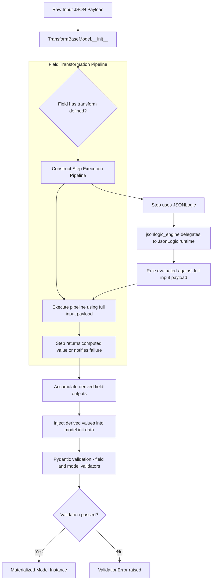

# Python-JSON Transformer

**Audience:** you want to add new transformation functions, understand how the engine chains them, and build new `OutputModel`s without surprises.

---

## 1. 30-second recap

- You **never write imperative code** to transform JSON.  
- You **declare** how each field is computed by chaining **typed Step objects**.  
- Only functions **explicitly exported** from `function_pool.py` can be used – no `eval`, no `exec`, no escape hatches.  
- The DSL is **pure Python**, so **autocomplete**, **type-checking**, and **refactor** work out of the box.

---

## 2. File map & responsibility

| File | Responsibility |
|------|----------------|
| `main.py` | **Runner**. Imports models from `rules.py`, loads JSON, prints results. *Never edited after scaffolding.* |
| `rules.py` | **User catalogue**. All `TransformBaseModel` subclasses live here. You add new models / fields here only. |
| `custom_basemodel.py` | **Pydantic glue**. Gives you `Field(..., transform=Step)` and the automatic execution hook. *Rarely touched.* |
| `step_engine.py` | **Micro-kernel**. Defines `Step`, `|`, and **only** `path(...)`. *Never contains business logic.* |
| `function_pool.py` | **Function supermarket**. Every transformation primitive you can use. *This is where you commit new code.* |

---

## 3. `step_engine.py` – line-by-line walk-through

```python
from __future__ import annotations
from typing import TypeVar, Callable, Any, Dict, Generic
```
- Future import lets us use lowercase generics (`Step[Dict[str, Any], str]`) inside the same file.  
- `Generic[T, U]` is the trick that gives **static type inference** for every transformation.

---

```python
T = TypeVar("T")
U = TypeVar("U")
V = TypeVar("V")
```
- One type-var per **position** in the chain:  
  `Step[T, U]` means “input type T, output type U”.

---

```python
class Step(Generic[T, U]):
    __slots__ = ("_fn",)

    def __init__(self, fn: Callable[[T], U]) -> None:
        self._fn = fn
```
- `Step` is **just a boxed function**.  
- `__slots__` keeps instances tiny (no per-instance `__dict__`).

---

```python
    def __call__(self, value: T) -> U:
        return self._fn(value)
```
- Makes the object **callable like a plain function** – important for the final execution inside `TransformBaseModel`.

---

```python
    def __or__(self, other: Step[U, V]) -> Step[T, V]:
        return Step(lambda v: other(self(v)))
```
- **Composition operator**.  
  `a | b` produces a **new** Step that first runs `a`, then feeds the result into `b`.  
  Because the lambda closes over `self` and `other`, **no new syntax** is required – it is still **pure Python**.

---

```python
class Path(Step[Dict[str, Any], Any]):
    def __init__(self, jsonpath: str) -> None:
        self._path = jsonpath
        super().__init__(self._resolve)
```
- `Path` **is-a** `Step` – therefore it can live on either side of `|`.  
- We **delay** the actual JSON-Path library import until **runtime** to keep start-up fast.

---

```python
    def _resolve(self, blob: Dict[str, Any]) -> Any:
        from jsonpath_ng import parse
        matches = parse(self._path).find(blob)
        if not matches:
            return ""          # legacy compatibility
        if len(matches) == 1:
            return matches[0].value
        return [m.value for m in matches]
```
- **Single walk** per path **per document**.  
- Returns **scalar** when only one hit, **list** otherwise – mimics `jsonpath_ng` default.

---

```python
path = Path  # convenience alias
```
- Lets users write `path("$.foo")` instead of `Path("$.foo")`.

---

That is **literally the whole kernel** – < 50 LOC, no magic, no exec.

---

## 4. Function pool catalogue – exhaustive examples

Every function **returns** a `Step[In, Out]` so it can be chained.

### 1. `CAPITALIZE` – simplest unary step
```python
from src.function_pool import CAPITALIZE
step = path("$.name") | CAPITALIZE()
assert step({"name": "alice"}) == "Alice"
```

### 2. `CONCAT` – configurable separator
```python
from src.function_pool import CONCAT
step = CONCAT(" - ")([path("$.a"), path("$.b")])
assert step({"a": "A", "b": "B"}) == "A - B"
```

### 3. `JOIN` – glue a list of strings
```python
from src.function_pool import JOIN
step = JOIN()(["foo", "bar"])
assert step({}) == "foobar"
```

### 4. `SUBSTR` – slice with bounds check
```python
from src.function_pool import SUBSTR
step = SUBSTR(0, 3)
assert step("abcdef") == "abc"
```

### 5. `GST_STATE_NAME` – dictionary lookup
```python
from src.function_pool import GST_STATE_NAME
step = path("$.gstin") | GST_STATE_NAME()
assert step({"gstin": "27AABCU9603R1ZX"}) == "Maharashtra"
```

### 6. `GST_DETAILS_ALL` – list-in, list-out
```python
from src.function_pool import GST_DETAILS_ALL
step = path("$.gst_records") | GST_DETAILS_ALL()
data = {"gst_records": [{"gst_number": "27AABCU9603R1ZX"}]}
assert step(data) == [{"gst_number": "27AABCU9603R1ZX", "pan_number": "AABCU9603R", "state_name": "Maharashtra"}]
```

### 7. `join_parts` – mixed literals + paths (high-level helper)
```python
from src.function_pool import join_parts
step = join_parts(
    path("$.first_name") | CAPITALIZE(),
    " ",
    path("$.last_name") | CAPITALIZE(),
)
assert step({"first_name": "john", "last_name": "doe"}) == "John Doe"
```

---

## 5. Combining many steps – real model snippet

```python
from src.rules import TransformBaseModel, Field
from src.step_engine import path
from src.function_pool import CAPITALIZE, join_parts, GST_DETAILS_ALL, SUBSTR

class CustomerModel(TransformBaseModel):
    display_name: str = Field(
        transform=join_parts(
            path("$.first_name") | CAPITALIZE(),
            " ",
            path("$.last_name") | CAPITALIZE(),
        )
    )

    initials: str = Field(
        transform=join_parts(
            path("$.first_name") | SUBSTR(0, 1) | CAPITALIZE(),
            ".",
            path("$.last_name") | SUBSTR(0, 1) | CAPITALIZE(),
            ".",
        )
    )

    gst_info: list[dict[str, str]] = Field(
        transform=path("$.gst_list") | GST_DETAILS_ALL()
    )
```

---

## 🔗 JsonLogic Integration

- Transform execution: field-level transforms are executed in the Pydantic `@model_validator(mode="before")` hook (see `src/custom_basemodel.py`), so transforms always run before Pydantic validation.
- JsonLogic is used as the transform engine: `JSONLOGIC(...)` in `src/function_pool.py` delegates to the evaluator exported by `src/jsonlogic_engine.py`, which in turn delegates to an installed external package (e.g. `jsonlogic` or `json-logic`).
- Recommended practice: keep JsonLogic rules in classic JsonLogic dict form (operators like `var`, `if`, `and`, `cat`) inside `rules.py` — the adapter will evaluate those rules against the full input blob.

Notes about external package compatibility:
- The project expects an external JsonLogic package to be installed; pin `jsonlogic` in `requirements.txt` to ensure reproducible behavior.
- Avoid editing files under `.venv/Lib/site-packages` in source control; if you previously patched a site-package during experimentation, revert it by reinstalling the package from PyPI:

```bash
pip install --upgrade --force-reinstall jsonlogic
```

If you need full parity with a specific JsonLogic distribution, pin the exact working version in `requirements.txt`.

## 🧰 Setup & Run (recommended, non-invasive)

1. Create and activate a virtual environment (PowerShell shown):

```powershell
python -m venv .venv
Set-ExecutionPolicy -Scope Process -ExecutionPolicy RemoteSigned -Force
.\.venv\Scripts\Activate.ps1
```

2. Install dependencies (pin preferred `jsonlogic`):

```bash
pip install -r requirements.txt
pip install jsonlogic
```

3. Run the demo runner:

```bash
python -m src.main
```

4. (Optional) Run tests:

```bash
pytest -q
```

## ✅ How this matches your requirement

- Pydantic's validation flow is unchanged: `TransformBaseModel` applies transforms before validation.
- Transform implementations are whitelisted in `src/function_pool.py` — you can add jsonlogic-style operator functions there to provide operator parity.
- The `JSONLOGIC` helper executes JsonLogic rules against the full input blob; if the external package is missing the process will fail early (the engine raises ImportError).

---

## 📂 Detailed File Structure

The repository layout below lists project files and their primary responsibilities (concise, third-person descriptions):

```text
validator_blackbox/
├── src/
│   ├── main.py              # Demo runner: instantiates models and pretty-prints outputs
│   ├── rules.py             # User Pydantic models and transform definitions used in demos
│   ├── function_pool.py     # Whitelisted transform operations, operator adapters, JSONLOGIC Step
│   ├── step_engine.py       # Core Step abstraction, Pipe composition and JSONPath helpers
│   ├── custom_basemodel.py  # Pydantic base class: runs transforms `before` validation
│   ├── custom_types.py      # Strict / domain types used by models (passport checks, etc.)
│   └── jsonlogic_engine.py  # Adapter that delegates JsonLogic evaluation to an installed package
├── tests/                   # Unit tests for transform behavior and override semantics
├── sample.json              # Representative, complex sample input used by demos
├── requirements.txt         # Python dependencies (pydantic, jsonpath-ng, etc.)
└── README.md                # Project documentation (this file)
```

## 🧾 Captured Sample Input & Output (real from demo run)

The examples below are taken directly from `sample.json` and from a verified run of the project's demo (`python -m src.main`). They are not invented — both input and outputs were pulled from the repository and the program run.

Input excerpt (from `sample.json`):

```json
{
  "visa_request_information": {
    "visa_request": {
      "from_country_full_name": "India",
      "to_country_full_name": "Taiwan",
      "departure_date_formatted": "01-Mar-2026",
      "arrival_date_formatted": "07-Mar-2026"
    }
  },
  "passport": {
    "passport_details": {
      "first_name": "PAULSTALIN JOONIS EVANS",
      "surname": "GODFREY PREM KIRUBA SEKAR",
      "passport_number": "B9517607",
      "gender": "M",
      "place_of_issue": "MADURAI",
      "address_line_1": "8ARACHAL STREET",
      "city": "NAGERCOIL",
      "state": "TAMIL NADU",
      "pin_code": "629001",
      "ovd_front": { "doc_name": "passport_front_813v6hrx.jpg" },
      "ovd_back": { "doc_name": "passport_back_dtg229eh.jpg" }
    }
  },
  "consultant_info": {
    "instruction_letter": {
      "upload_instruction": { "doc_name": "instruction_RvGJ19dW_qj8fryw0.pdf" }
    }
  },
  "gst_records": [
    { "gst_number": "29ABCDE1234F1Z5" },
    { "gst_number": "27PQRSX5678L1Z3" },
    { "gst_number": "07LMNOP9876Q1Z9" }
  ]
}
```

Selected outputs produced by the demo (exact JSON printed by the program):

CustomerNameModel Output:

```json
{
  "full_name": "Paulstalin Godfrey",
  "display_name": "Paulstalin Godfrey"
}
```

TravelInfoModel Output:

```json
{
  "travel_summary": "India → Taiwan (01-Mar-2026 to 07-Mar-2026)",
  "country": "Unknown"
}
```

CustomerProfileModel Output (includes GST derivation):

```json
{
  "passport_number": "B9517607",
  "gender": "M",
  "customer_name": "Paulstalin joonis evans Godfrey prem kiruba sekar",
  "gst_outputs": [
    { "gst_number": "29ABCDE1234F1Z5", "pan_number": "ABCDE1234F", "state_name": "Karnataka" },
    { "gst_number": "27PQRSX5678L1Z3", "pan_number": "PQRSX5678L", "state_name": "Maharashtra" },
    { "gst_number": "07LMNOP9876Q1Z9", "pan_number": "LMNOP9876Q", "state_name": "Delhi" }
  ]
}
```

DocumentSummaryModel Output (documents derived):

```json
{
  "passport_front": "passport_front_813v6hrx.jpg",
  "passport_back": "passport_back_dtg229eh.jpg",
  "instruction_doc": "instruction_RvGJ19dW_qj8fryw0.pdf",
  "application_form_doc": null,
  "has_passport_docs": true
}
```

LocationModel Output (address consolidation):

```json
{
  "residential": "NAGERCOIL, TAMIL NADU 629001",
  "passport_place_of_issue": "MADURAI",
  "preferred_location": "Nagercoil, tamil nadu",
  "nearby_state_match": false,
  "age_group": "Adult"
}
```

These outputs were produced by running `python -m src.main` in the repository; they demonstrate how transforms map input fields to derived, validated model attributes.

## 🔁 Full Process Flow (detailed)

The diagram below shows the full transform + validation lifecycle used in the project. It expands the earlier, simple flow with internal steps executed per field.


```mermaid
flowchart TD
    A[Raw Input JSON Payload] --> B[TransformBaseModel.__init__]
    B --> C{Field has transform defined?}

    subgraph FP[Field Transformation Pipeline]
        direction TB
        C --> D1[Construct Step Execution Pipeline]
        D1 --> D2[Execute pipeline using full input payload]
        D2 --> D3[Step returns computed value or notifies failure]
    end

    D3 --> E[Accumulate derived field outputs]
    E --> F[Inject derived values into model init data]
    F --> G[Pydantic validation - field and model validators]
    G --> H{Validation passed?}

    H -- Yes --> I[Materialized Model Instance]
    H -- No --> J[ValidationError raised]

    D1 --> K[Step uses JSONLogic]
    K --> K1[jsonlogic_engine delegates to JsonLogic runtime]
    K1 --> K2[Rule evaluated against full input payload]
    K2 --> D2
```

### Notes
- The transform stage runs before the Pydantic validation step so computed values are validated as normal fields.
- `JSONLOGIC(...)` in `function_pool.py` is the single integration point for classic JsonLogic rules. The engine currently requires an installed external package and will raise ImportError if none is available.
- For reproducible runs and CI, the repository recommends pinning a compatible `jsonlogic` package version in `requirements.txt` and avoiding local edits to the virtual environment site-packages.

---

>>>>>>> Stashed changes
