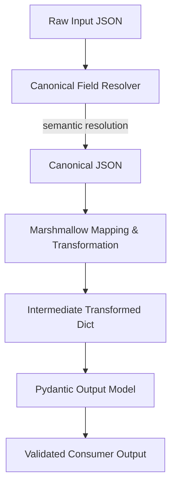

# 🧩 Transformation Blackbox  
## Canonical Field Resolver + Marshmallow + Pydantic

---

## 📌 Overview

This document explains a **deterministic, scalable data‑transformation architecture** that converts **arbitrary input JSON** into **strict, validated Pydantic output models**, without hard‑coding input field names.

The core problem addressed is **input variability**:
- Different field names (`first_name`, `fname`, `f1`)
- Different structures (flat vs nested)
- Different formats (ISO dates, Mongo `$date`, strings)

The solution introduces a **Canonical Field Resolver** upstream of Marshmallow and Pydantic.

---

## 🎯 Core Design Principle

> **Resolve semantics first, then transform, then validate**

Each stage answers exactly one question:
- **What does this field represent?**
- **How should it be reshaped?**
- **Is it valid?**

---

## 🏗️ High‑Level Architecture


---

## 🔄 Mermaid Diagram — Flow of Events



## ✅ Canonical Field Resolver (Key Idea)

The **Canonical Field Resolver** is a dedicated layer that:

- Scans all keys in the input JSON
- Applies fuzzy matching, or optional AI
- Determines which input key corresponds to which **canonical field**
- Rewrites the input JSON using **stable canonical names**

## 🧾 Example — Raw Input JSON (Untrusted)

```json
{
  "f1": "PAULSTALIN",
  "lname": "GODFREY",
  "pass_no": "B9517607",
  "dob": "2000-01-22T00:00:00.000Z",
  "nat": "Indian"
}
```

### Problems
- Inconsistent naming
- No schema guarantees
- Not directly usable

## 🔍 Step 1 — Semantic Resolution

The resolver determines intent by mapping incoming keys to canonical fields:

| Canonical Field     | Input Key |
|---------------------|-----------|
| `first_name`        | `f1`      |
| `last_name`         | `lname`   |
| `passport_number`   | `pass_no` |
| `date_of_birth`     | `dob`     |
| `nationality`       | `nat`     |

---

## 🧾 Canonical JSON (Post-Resolution)

```json
{
  "first_name": "PAULSTALIN",
  "last_name": "GODFREY",
  "passport_number": "B9517607",
  "date_of_birth": "2000-01-22T00:00:00.000Z",
  "nationality": "Indian"
}
```

### Key Properties
- Stable field names
- Semantic ambiguity resolved once
- Downstream layers ignore original input shape

---

## 🔄 Step 2 — Marshmallow Mapping & Transformation

Marshmallow now performs **explicit, deterministic transformations**, such as:

### Concatenation
```text
full_name = first_name + " " + last_name
```
### Date Formatting
```text
ISO → DD-Mon-YYYY
```
## 🧪 Conceptual Marshmallow Output

```json
{
  "full_name": "PAULSTALIN GODFREY",
  "passport_number": "B9517607",
  "nationality": "Indian",
  "date_of_birth": "22-Jan-2000"
}
```
## ✅ Step 3 — Pydantic Contract Validation

The transformed payload is passed to a **Pydantic output model**.

Pydantic enforces:
- Required fields
- Data types
- Regex / format constraints

---

### Validation Outcomes

**If validation fails:**
- Execution stops immediately

**If validation succeeds:**
- Output is guaranteed correct

---

## 🎉 Final Output (Consumer-Ready)

```json
{
  "full_name": "PAULSTALIN GODFREY",
  "passport_number": "B9517607",
  "nationality": "Indian",
  "date_of_birth": "22-Jan-2000"
}
```


